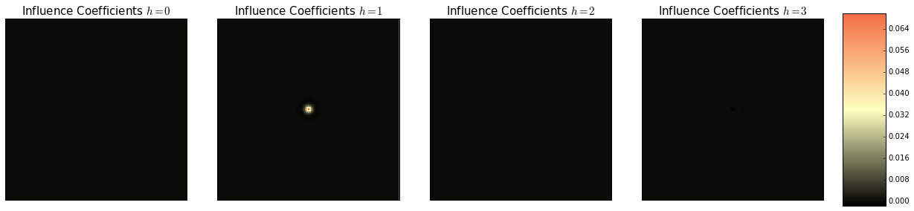

Cahn-Hilliard with Primtive and Legendre Bases
==============================================

This example uses a Cahn-Hilliard model to compare two different bases
representations to discretize the microstructure. One basis
representaion uses the primitive (or hat) basis and the other uses
Legendre polynomials. The example includes the background theory about
using Legendre polynomials as a basis in MKS. The MKS with two different
bases are compared with the standard spectral solution for the
Cahn-Hilliard solution at both the calibration domain size and a scaled
domain size.

Cahn-Hilliard Equation
~~~~~~~~~~~~~~~~~~~~~~

The Cahn-Hilliard equation is used to simulate microstructure evolution
during spinodial decomposition and has the following form,

.. math::  \dot{\phi} = \nabla^2 \left( \phi^3 - \phi \right) - \gamma \nabla^4 \phi 

where :math:`\phi` is a conserved ordered parameter and
:math:`\sqrt{\gamma}` represents the width of the interface. In this
example, the Cahn-Hilliard equation is solved using a semi-implicit
spectral scheme with periodic boundary conditions, see `Chang and
Rutenberg <http://dx.doi.org/10.1103/PhysRevE.72.055701>`__ for more
details.

Basis Functions for the Microstructure Function and Influence Function
~~~~~~~~~~~~~~~~~~~~~~~~~~~~~~~~~~~~~~~~~~~~~~~~~~~~~~~~~~~~~~~~~~~~~~

In this example, we will explore the differences when using the Legendre
polynomials as the basis function compared to the primitive (or hat)
basis for the microstructure function and the influence coefficients.

For more information about both of these basis please see the `theory
section <THEORY.html>`__.

.. code:: python

    %matplotlib inline
    %load_ext autoreload
    %autoreload 2
    
    import numpy as np
    import matplotlib.pyplot as plt
Modeling with MKS
-----------------

Generating Calibration Datasets
~~~~~~~~~~~~~~~~~~~~~~~~~~~~~~~

Because the microstructure is a continuous field that can have a range
of values and changes over time, the first order influence coefficients
cannot be calibrated with delta microstructures. Instead a large number
of simulations with random initial conditions will be used to calibrate
the first order influence coefficients using linear regression. Let's
show how this is done.

The function ``make_cahnHilliard`` from ``pymks.datasets`` provides a
nice interface to generate calibration datasets for the influence
coefficients. The funcion ``make_cahnHilliard`` requires the number of
calibration samples given by ``n_samples`` and the size and shape of the
domain given by ``size``.

.. code:: python

    import pymks
    from pymks.datasets import make_cahn_hilliard
    
    length = 41
    n_samples = 400
    dt = 1e-2
    np.random.seed(101)
    size=(length, length)
    X, y = make_cahn_hilliard(n_samples=n_samples, size=size, dt=dt)
The function ``make_cahnHilliard`` has generated ``n_samples`` number of
random microstructures, ``X``, and returned the same microstructures
after they have evolved for one time step given by ``y``. Let's take a
look at one of them.

.. code:: python

    from pymks.tools import draw_concentrations
    
    draw_concentrations((X[0], y[0]),('Calibration Input', 'Calibration Output'))

.. image:: cahn_hilliard_Legendre_files/cahn_hilliard_Legendre_7_0.png

Calibrate Influence Coefficients
~~~~~~~~~~~~~~~~~~~~~~~~~~~~~~~~

In this example, we compare the difference between using the primitive
(or hat) basis and the Legendre polynomial basis to represent the
microstructure function. As mentioned above, the microstructures
(concentration fields) are not discrete phases. This leaves the number
of local states in local state space ``n_states`` as a free hyper
parameter. In the next section we look to see what a practical number of
local states for bases would be.

Optimizing the Number of Local States
^^^^^^^^^^^^^^^^^^^^^^^^^^^^^^^^^^^^^

Below, we compare the difference in performance as we vary the local
state when we choose the primitive basis and the Legendre polynomial
basis.

The ``(X, y)`` sample data is split into training and test data. The
code then optimizes ``n_states`` between ``2`` and ``11`` and the two
``basis`` with the ``parameters_to_tune`` variable. The ``GridSearchCV``
takes an ``MKSLocalizationModel`` instance, a ``scoring`` function
(figure of merit) and the ``parameters_to_tune`` and then finds the
optimal parameters with a grid search.

.. code:: python

    from pymks.bases import PrimitiveBasis
    from sklearn.grid_search import GridSearchCV
    from sklearn import metrics
    mse = metrics.mean_squared_error
    from pymks.bases import LegendreBasis
    from pymks import MKSLocalizationModel
    from sklearn.cross_validation import train_test_split
    
    train_split_shape = (X.shape[0],) + (np.prod(X.shape[1:]),)
    
    X_train, X_test, y_train, y_test = train_test_split(X.reshape(train_split_shape),
                                                        y.reshape(train_split_shape),
                                                        test_size=0.5, random_state=3)
    
    prim_basis = PrimitiveBasis(2, [-1, 1])
    leg_basis = LegendreBasis(2, [-1, 1])
    
    params_to_tune = {'n_states': np.arange(2, 11),
                     'basis': [prim_basis, leg_basis]}
    Model = MKSLocalizationModel(prim_basis)
    scoring = metrics.make_scorer(lambda a, b: -mse(a, b))
    fit_params = {'size': size}
    gs = GridSearchCV(Model, params_to_tune, cv=5, fit_params=fit_params, n_jobs=3).fit(X_train, y_train)
The optimal parameters are the ``LegendreBasis`` with only 4 local
states. More terms don't improve the R-squared value.

.. code:: python

    print(gs.best_estimator_)
    print(gs.score(X_test, y_test))

.. parsed-literal::

    MKSLocalizationModel(basis=<pymks.bases.legendre.LegendreBasis object at 0x7fa6f49e4210>,
               n_states=4)
    1.0

.. code:: python

    from pymks.tools import draw_gridscores
    
    lgs = [x for x in gs.grid_scores_ \
           if type(x.parameters['basis']) is type(leg_basis)]
    cgs = [x for x in gs.grid_scores_ \
           if type(x.parameters['basis']) is type(prim_basis)]
    
    draw_gridscores([lgs, cgs], 'n_states', data_labels=['Legendre', 'Primitve'],
                    colors=['#f46d43', '#1a9641'], score_label='R-Squared', 
                    param_label = 'L - Total Number of Local States')

.. image:: cahn_hilliard_Legendre_files/cahn_hilliard_Legendre_12_0.png

As you can see the ``LegendreBasis`` converges faster than the
``PrimitiveBasis``. In order to further compare performance between the
two models, lets select 4 local states for both bases.

Comparing the Bases for ``n_states=4``
~~~~~~~~~~~~~~~~~~~~~~~~~~~~~~~~~~~~~~

.. code:: python

    prim_basis = PrimitiveBasis(n_states=4, domain=[-1, 1])
    prim_model = MKSLocalizationModel(basis=prim_basis)
    prim_model.fit(X, y)
    
    leg_basis = LegendreBasis(4, [-1, 1])
    leg_model = MKSLocalizationModel(basis=leg_basis)
    leg_model.fit(X, y)
Now let's look at the influence coefficients for both bases.

First the ``PrimitiveBasis`` influence coefficients

.. code:: python

    from pymks.tools import draw_coeff
    
    draw_coeff(prim_model.coeff)

.. image:: cahn_hilliard_Legendre_files/cahn_hilliard_Legendre_17_0.png

Now for the ``LegendreBasis`` influence coefficients.

.. code:: python

    draw_coeff(leg_model.coeff)

.. image:: cahn_hilliard_Legendre_files/cahn_hilliard_Legendre_19_0.png

Now let's do some simulations with both sets of coefficients and compare
the results.

Predict Microstructure Evolution
~~~~~~~~~~~~~~~~~~~~~~~~~~~~~~~~

In order to compare the difference between the two bases, we need to
have the Cahn-Hilliard simulation and the two MKS models start with the
same initial concentration ``phi0`` and evolve in time. In order to do
the Cahn-Hilliard simulation we need an instance of the class
``CahnHilliardSimulation``.

.. code:: python

    from pymks.datasets.cahn_hilliard_simulation import CahnHilliardSimulation
    np.random.seed(66)
    
    phi0 = np.random.normal(0, 1e-9, ((1,) + size))
    ch_sim = CahnHilliardSimulation(dt=dt)
    phi_sim = phi0.copy()
    phi_prim = phi0.copy()
    phi_legendre = phi0.copy()
    

Let's look at the inital concentration field.

.. code:: python

    draw_concentrations([phi0[0]], ['Initial Concentration'])

.. image:: cahn_hilliard_Legendre_files/cahn_hilliard_Legendre_24_0.png

In order to move forward in time, we need to feed the concentration back
into the Cahn-Hilliard simulation and the MKS models.

.. code:: python

    time_steps = 50
    
    for steps in range(time_steps):
        ch_sim.run(phi_sim)
        phi_sim = ch_sim.response
        phi_prim = prim_model.predict(phi_prim)
        phi_legendre = leg_model.predict(phi_legendre)
Let's take a look at the concentration fields.

.. code:: python

    from pymks.tools import draw_concentrations
    
    draw_concentrations((phi_sim[0], phi_prim[0], phi_legendre[0]),
                        ('Simulation', 'Primative', 'Legendre'))

.. image:: cahn_hilliard_Legendre_files/cahn_hilliard_Legendre_28_0.png

By just looking at the three microstructures is it difficult to see any
differences. Below, we plot the difference between the two MKS models
and the simulation.

.. code:: python

    from sklearn import metrics
    mse = metrics.mean_squared_error
    from pymks.tools import draw_differences
    
    draw_differences([(phi_sim[0] - phi_prim[0]), (phi_sim[0] - phi_legendre[0])],
                     ['Simulaiton - Prmitive', 'Simulation - Legendre'])
    
    print 'Primative mse =', mse(phi_sim[0], phi_prim[0])
    print 'Legendre mse =', mse(phi_sim[0], phi_legendre[0])

.. image:: cahn_hilliard_Legendre_files/cahn_hilliard_Legendre_30_0.png

.. parsed-literal::

    Primative mse = 5.28702717916e-23
    Legendre mse = 4.35706317904e-28

The ``LegendreBasis`` basis clearly out performs the ``PrimitiveBasis``
for the same value of ``n_states``.

Resizing the Coefficients to use on Larger Systems
--------------------------------------------------

Below we compare the bases after the coefficients are resized.

.. code:: python

    big_length = 3 * length
    big_size = (big_length, big_length)
    prim_model.resize_coeff(big_size)
    leg_model.resize_coeff(big_size)
    
    phi0 = np.random.normal(0, 1e-9, (1,) + big_size)
    phi_sim = phi0.copy()
    phi_prim = phi0.copy()
    phi_legendre = phi0.copy()

Let's take a look at the initial large concentration field.

.. code:: python

    draw_concentrations([phi0[0]], ['Initial Concentration'])

Let's look at the resized coefficients.

First the influence coefficients from the ``PrimitiveBasis``.

.. code:: python

    draw_coeff(prim_model.coeff)

.. image:: cahn_hilliard_Legendre_files/cahn_hilliard_Legendre_37_0.png

Now the influence coefficients from the ``LegendreBases``.

.. code:: python

    draw_coeff(leg_model.coeff)

.. image:: cahn_hilliard_Legendre_files/cahn_hilliard_Legendre_39_0.png

Once again we are going to march forward in time by feeding the
concentration fields back into the Cahn-Hilliard simulation and the MKS
models.

.. code:: python

    for steps in range(time_steps):
        ch_sim.run(phi_sim)
        phi_sim = ch_sim.response
        phi_prim = prim_model.predict(phi_prim)
        phi_legendre = leg_model.predict(phi_legendre)
.. code:: python

    draw_concentrations((phi_sim[0], phi_prim[0], phi_legendre[0]), ('Simulation', 'Primiative', 'Legendre'))

.. image:: cahn_hilliard_Legendre_files/cahn_hilliard_Legendre_42_0.png

Both the MKS models seem to predict the concentration faily well.
However, the Legendre polynomial basis looks to be better. Again let's
look at the difference between the simulation and the MKS models.

.. code:: python

    draw_differences([(phi_sim[0] - phi_prim[0]), (phi_sim[0] - phi_legendre[0])], 
                     ['Simulaiton - Primiative','Simulation - Legendre'])
    
    print 'Primative mse =', mse(phi_sim[0], phi_prim[0])
    print 'Legendre mse =', mse(phi_sim[0], phi_legendre[0])

.. image:: cahn_hilliard_Legendre_files/cahn_hilliard_Legendre_44_0.png

.. parsed-literal::

    Primative mse = 4.43202082745e-23
    Legendre mse = 4.45272856882e-28

With the resized influence coefficients, the ``LegendreBasis``
outperforms the ``PrimitiveBasis`` for the same value of ``n_states``.
The value of ``n_states`` does not necessarily guarantee a fair
comparison between the two basis in terms of floating point calculations
and memory used.

